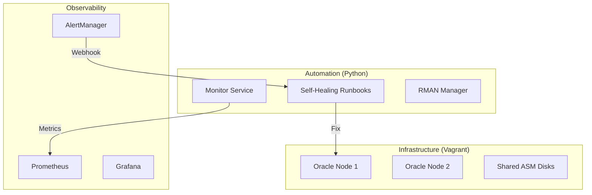

# ORAEX Lab: Oracle Database Reliability Engineering (DBRE)

> 🚀 **Automated Oracle Database Infrastructure & Self-Healing Platform**
>
> *From ISO to Automation: A Deep Dive into SRE, Python, and Ansible.*

[](https://www.python.org/downloads/)
[](https://www.ansible.com/)
[](https://www.oracle.com/database/)
[](LICENSE)

---

## 📖 About The Project

**ORAEX Lab** is a personal engineering study designed to simulate a real-world, high-performance database environment. The goal was to move away from manual DBA tasks ("ClickOps") and embrace **Database Reliability Engineering (DBRE)** principles.

This repository contains the complete Infrastructure as Code (IaC) and Automation suite used to build, configure, and manage Oracle 19c databases in a **Non-Production (NPROD)** simulation.

### 🌟 Key Features

- **Infrastructure as Code**: `Vagrant` + `VirtualBox` to simulate Data Center hardware (Shared Disks, Private Network).
- **Configuration Management**: `Ansible` playbooks for OS bootstrapping (Kernel, Limits, Packages) and Oracle Grid/DB deployment.
- **Smart Automation**: A Python-based "Robot DBA" that monitors metrics and executes self-healing runbooks.
- **Observability**: Prometheus & Grafana stack for real-time metrics, not just "up/down" monitoring.

---

## 🏗️ Architecture

The lab simulates a RAC-ready architecture with automated management:



---

## 📂 Project Structure

```bash
oraex-nprod/
├── infra/                  # The Foundation
│   ├── Vagrantfile         # Defines VMs, Networks, and Shared Disks
│   └── ansible/            # Playbooks for OS Config & Oracle Install
├── automacao/              # The "Robot DBA" (Python)
│   ├── runbooks/           # Logic for remedial actions
│   │   ├── tablespace_auto_resize.py  # Auto-expand storage safely
│   │   ├── listener_auto_restart.py   # High Availability watchdog
│   │   ├── archive_cleanup.py         # Prevent Archiver Stuck
│   └── backup/             # Object-Oriented RMAN Manager
├── observability/          # Monitoring Stack
│   ├── prometheus/         # Scrapers & Rules
│   └── grafana/            # Dashboards
└── Dockerfile              # Containerized Automation Runtime
```

---

## 🔧 Technical Highlights

### 1. Self-Healing with Safety Guardrails

Unlike simple shell scripts, the Python automation includes logic to prevent "cascading failures".
*Example: The Tablespace Resizer checks if it has already expanded the file too many times today before acting.*

### 2. RMAN as Code

Backup management is handled by a Python class wrapper around RMAN, parsing `V$RMAN_BACKUP_JOB_DETAILS` to ensure backups are valid and logged in JSON format for auditing.

### 3. Grid Infrastructure Automation

The Ansible roles handle the complex prerequisites of Oracle Grid (cvuqdisk, groups, users, ASMlib) automatically, allowing for a reproducible build process.

---

## 🚀 Getting Started

To spin up this lab on your local machine:

### Prerequisites

- VirtualBox & Vagrant
- Python 3.9+
- Ansible

### Quick Start

```bash
# 1. Provision Infrastructure
cd infra
vagrant up

# 2. Deploy Software (Ansible)
ansible-playbook -i inventory/hosts site.yml

# 3. Start Automation
pip install -r requirements.txt
python -m automacao.runbooks.runner --runbook listener --dry-run
```

---

## 👤 Author

**Jonathan Ferreira**
*Oracle DBA & Cloud Engineer | Enthusiast of SRE & DevOps*

---

## 📜 License

Distributed under the MIT License. See `LICENSE` for more information.
