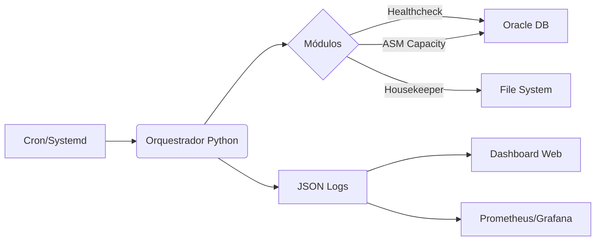

# ORAEX: Modernização de Monitoramento Oracle

## De Scripts Legados para Automação DBRE Inteligente

**Cliente:** Getnet | **Data:** Fevereiro 2026

---

# 1. O Desafio (Antes) 🕸️

* **Legado Crítico**: Scripts em Shell (Ksh/Bash) antigos e complexos.
* **Manutenção Difícil**: "Espaguete code", difícil de debugar e evoluir.
* **Visibilidade Baixa**: Logs em arquivos de texto dispersos (`grep` manual).
* **Reativo**: Só sabemos do erro quando o cliente reclama.
* **Risco Operacional**: Scripts rodando como root ou sem controle de processo.

---

# 2. A Solução (ORAEX) 🚀

Transformamos scripts isolados em uma **Plataforma de Automação**.

* **Core em Python**: Código moderno, orientado a objetos e testável.
* **Conceito DBRE**: *Database Reliability Engineering* (Automação como Código).
* **Compatibilidade Total**: Roda em RHEL 6/7/8 (Python 3.6+), sem dependências externas complexas.
* **Observabilidade**: Logs estruturados (JSON) e métricas para Prometheus.

---

# 3. Arquitetura da Solução 🏗️

* **Modular**: Cada script faz UMA coisa bem feita (SRP).
* **Resiliente**: Tratamento de erros robusto e dados "Mock" em caso de falha de conexão.
* **Seguro**: Não salva senhas em texto plano (suporte a Wallet/Vars).

---

# 4. Entregáveis Técnicos 📦

1. **Healthcheck Unificado**: `oracle_healthcheck.py` (Substitui vários .sh).
2. **Monitoramento ASM**: Predição de crescimento de disco.
3. **Housekeeper Seguro**: Limpeza de logs e homes velhas com *Dry-Run*.
4. **Dashboard Executivo**: Interface Web Dark Mode para visualização rápida.
5. **Exporters**: Integração nativa com Grafana/Zabbix.

---

# 5. Segurança & Compliance 🛡️

* **Zero Root**: Tudo roda como usuário `oracle`.
* **ReadOnly First**: Scripts de diagnósticos são apenas leitura.
* **Dry-Run**: Scripts destrutivos (limpeza) simulam antes de apagar.
* **Auditável**: Tudo gera log padronizado.

---

# 6. Próximos Passos (Roadmap) 🗺️

* [ ] Implantar em Produção (Piloto).
* [ ] Integrar com Zabbix Oficial da Getnet.
* [ ] Ativar "Self-Healing" (correção automática de problemas simples).
* [ ] Expansão para Exadata.

---

# OBRIGADO! 🤝

**Projeto ORAEX**
*Modernizando a Infraestrutura de Dados*
