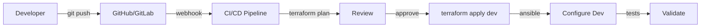

# Estratégia de Transformação para 100% IaC - Getnet NPROD

**Autor:** Equipe DBRE Antigravity  
**Data:** Fevereiro 2026  
**Objetivo:** Transformar toda infraestrutura Getnet em Infrastructure as Code (IaC)

---

## 📋 Visão Executiva

Este documento define a estratégia completa para transformar a infraestrutura de banco de dados da Getnet em **100% Infrastructure as Code (IaC)**, aplicando princípios de **Database Reliability Engineering (DBRE)**.

### Objetivos Principais

1. **Eliminar Provisionamento Manual**: Zero intervenção manual em criação/modificação de recursos
2. **Versionamento Completo**: Toda infraestrutura versionada em Git
3. **Reprodutibilidade**: Ambientes idênticos (Dev → Homol → Prod)
4. **Compliance Automatizado**: Validação automática de políticas (Book DBA)
5. **Observabilidade Nativa**: Métricas e logs estruturados desde o provisionamento

---

## 🏗️ Arquitetura IaC: Pilares Fundamentais

### 1. Terraform: Provisionamento Declarativo

**Responsabilidade:** Criar, modificar e destruir recursos de infraestrutura

```
infra/terraform/
├── modules/                    # Módulos reutilizáveis
│   ├── oracle-rac/            # Módulo Oracle RAC completo
│   ├── oracle-standalone/    # Módulo Oracle standalone
│   ├── mongodb-cluster/       # Módulo MongoDB (Atlas/On-Prem)
│   ├── networking/            # VPCs, Subnets, Security Groups
│   ├── storage/               # ASM, NFS, Block Storage
│   └── monitoring/            # Prometheus, Grafana, AlertManager
├── environments/              # Configurações por ambiente
│   ├── development/
│   ├── staging/
│   └── production/
└── shared/                    # Recursos compartilhados
    ├── backend.tf            # State remoto (S3/Terraform Cloud)
    └── providers.tf          # Configuração de providers
```

**Princípios:**
- **Módulos Parametrizáveis**: Um módulo Oracle RAC serve para Dev e Prod (apenas variáveis diferentes)
- **State Remoto**: State file em backend seguro (S3 + DynamoDB lock)
- **Workspaces**: Isolamento por ambiente sem duplicação de código
- **Data Sources**: Consultar recursos existentes antes de criar novos

### 2. Ansible: Configuração e Gerenciamento Contínuo

**Responsabilidade:** Configurar recursos após provisionamento e gerenciamento contínuo

```
infra/ansible/
├── playbooks/
│   ├── provision.yml         # Executado após Terraform (bootstrap)
│   ├── configure-oracle.yml  # Configuração Oracle (init.ora, sqlnet.ora)
│   ├── configure-mongodb.yml # Configuração MongoDB
│   ├── deploy-automation.yml # Deploy scripts ORAEX
│   └── patch-management.yml  # Aplicação de patches (PSU)
├── roles/
│   ├── oracle-install/       # Instalação Oracle 19c
│   ├── oracle-rac-setup/     # Configuração RAC
│   ├── oraex-automation/     # Deploy automações Python
│   └── monitoring-setup/     # Configuração Prometheus exporters
└── inventory/
    ├── terraform-inventory/  # Gerado automaticamente pelo Terraform
    └── static/               # Inventário estático (backup)
```

**Integração Terraform → Ansible:**
```yaml
# Terraform gera inventory dinâmico
terraform output -json > ansible/inventory/terraform-inventory/hosts.json
ansible-playbook -i terraform-inventory/ playbooks/provision.yml
```

### 3. Python (ORAEX): Automação Operacional DBRE

**Responsabilidade:** Operações diárias, monitoramento, auto-healing

```
automacao/
├── diagnosticos/            # Healthchecks, compliance
├── monitoramento/           # Métricas, alertas
├── backup/                  # RMAN, mongodump
├── sustentacao/             # Housekeeping, log rotation
└── runbooks/                # Runbooks automatizados (novo!)
    ├── incident_response.py
    ├── failover_automation.py
    └── capacity_planning.py
```

---

## 🎯 Conceitos DBRE Aplicados

### 1. Service Level Objectives (SLOs)

Definir SLOs mensuráveis para cada banco de dados:

```yaml
# infra/terraform/modules/oracle-rac/slos.tf
slo_availability: 99.95%  # 4.38 horas de downtime/mês
slo_rpo: 1h                # Recovery Point Objective
slo_rto: 30min             # Recovery Time Objective
slo_connection_pool: 80%   # Pool nunca acima de 80%
```

**Implementação:**
- Terraform valida recursos mínimos para atingir SLOs
- Ansible configura alertas baseados em SLOs
- Python monitora e reporta violações

### 2. Service Level Indicators (SLIs)

Métricas que alimentam os SLOs:

```python
# automacao/monitoramento/sli_tracker.py
SLIs = {
    "availability": "uptime_percentage",
    "latency_p95": "query_response_time_p95",
    "error_rate": "failed_queries / total_queries",
    "throughput": "transactions_per_second"
}
```

### 3. Runbooks Automatizados

Transformar runbooks manuais em código executável:

```python
# automacao/runbooks/failover_automation.py
class FailoverRunbook:
    def execute(self, database: str):
        # 1. Validar pré-condições
        # 2. Executar failover
        # 3. Validar pós-condições
        # 4. Notificar equipe
        # 5. Registrar em CMDB
```

### 4. Chaos Engineering (Opcional - Futuro)

Testes automatizados de resiliência:

```yaml
# infra/chaos/
experiments:
  - name: "kill-primary-node"
    target: "oracle-rac-primary"
    expected: "automatic-failover-to-secondary"
```

---

## 📐 Estrutura Multi-Ambiente

### Workspaces Terraform

```bash
# Desenvolvimento
terraform workspace select dev
terraform apply -var-file=environments/dev/terraform.tfvars

# Staging
terraform workspace select staging
terraform apply -var-file=environments/staging/terraform.tfvars

# Produção
terraform workspace select prod
terraform apply -var-file=environments/prod/terraform.tfvars
```

### Variáveis por Ambiente

```hcl
# environments/dev/terraform.tfvars
instance_type = "t3.medium"
node_count = 2
backup_retention_days = 7

# environments/prod/terraform.tfvars
instance_type = "r5.2xlarge"
node_count = 4
backup_retention_days = 30
enable_encryption = true
```

---

## 🔄 Fluxo de Trabalho Completo (IaC Pipeline)

### 1. Desenvolvimento



### 2. Deploy em Produção

```bash
# 1. Terraform Plan (Dry-Run)
terraform plan -out=tfplan -var-file=environments/prod/terraform.tfvars

# 2. Review do Plan (Human Approval)
terraform show tfplan

# 3. Apply (Cria/Modifica Recursos)
terraform apply tfplan

# 4. Ansible (Configuração)
ansible-playbook -i terraform-inventory/ playbooks/provision.yml

# 5. Validação
python automacao/diagnosticos/oracle_healthcheck.py --json
```

---

## 🛡️ Segurança e Compliance

### 1. Gestão de Secrets

**Nunca hardcode!** Usar:
- **HashiCorp Vault** (On-Prem)
- **AWS Secrets Manager** (Cloud)
- **Azure Key Vault** (Azure)

```hcl
# Terraform usa Vault
data "vault_generic_secret" "oracle_credentials" {
  path = "secret/oracle/prod"
}

resource "vsphere_virtual_machine" "db" {
  # Usa secret do Vault
  extra_config = {
    "oracle.password" = data.vault_generic_secret.oracle_credentials.data["password"]
  }
}
```

### 2. Compliance Automatizado

```python
# automacao/diagnosticos/compliance_checker.py
COMPLIANCE_RULES = {
    "force_logging": "ON",
    "recyclebin": "ON",
    "tde_wallet": "CONFIGURED",
    "backup_retention": ">= 7 days"
}

def validate_compliance():
    violations = []
    for rule, expected in COMPLIANCE_RULES.items():
        if not check_rule(rule, expected):
            violations.append(rule)
    return violations
```

### 3. Auditoria e Rastreabilidade

- **Terraform State**: Histórico de mudanças
- **Ansible Logs**: Todas as execuções logadas
- **Git History**: Versionamento de código IaC

---

## 📊 Observabilidade Nativa

### 1. Métricas de Infraestrutura

Terraform exporta métricas de recursos criados:

```hcl
# Terraform Output → Prometheus
output "oracle_nodes" {
  value = {
    count = length(vsphere_virtual_machine.rac_nodes)
    cpu = sum([vm.num_cpus for vm in vsphere_virtual_machine.rac_nodes])
    memory_gb = sum([vm.memory / 1024 for vm in vsphere_virtual_machine.rac_nodes])
  }
}
```

### 2. Logs Estruturados

Todos os scripts Python já usam `logging_config.py` (JSON):
- Terraform: `TF_LOG=JSON terraform apply`
- Ansible: `ANSIBLE_STDOUT_CALLBACK=json`

---

## 🚀 Roadmap de Implementação

### Fase 1: Fundação (Mês 1-2)
- [x] Estrutura Terraform modular
- [x] Integração Terraform + Ansible
- [x] Scripts de configuração de backend remoto (S3 + DynamoDB)
- [x] Estrutura de workspaces multi-ambiente

### Fase 2: Oracle RAC Completo (Mês 3-4)
- [x] Módulo Terraform Oracle RAC (estrutura completa)
- [x] Validação de SLOs (slo_tracker.py)
- [x] Runbooks automatizados (estrutura base + failover)
- [x] Ansible role para instalação/configuração Oracle 19c

### Fase 3: MongoDB (Mês 5-6)
- [ ] Módulo Terraform MongoDB (Atlas + On-Prem)
- [ ] Ansible para configuração ReplicaSet
- [ ] Integração com automações Python existentes

### Fase 4: PostgreSQL + MySQL (Mês 7-8)
- [ ] Módulos Terraform para cada DB
- [ ] Ansible roles específicos
- [ ] Automações Python (monitoramento, backup)

### Fase 5: Consolidação (Mês 9-12)
- [ ] Dashboard unificado (todos os DBs)
- [ ] CI/CD completo (GitOps)
- [ ] Documentação operacional
- [ ] Treinamento equipe Getnet

---

## 📚 Referências e Boas Práticas

### DBRE
- **Site Reliability Engineering (SRE) Book** - Google
- **Database Reliability Engineering** - Laine Campbell & Charity Majors
- **Terraform Best Practices** - HashiCorp

### IaC Patterns
- **Module Composition**: Módulos pequenos e reutilizáveis
- **Environment Parity**: Mesmo código, diferentes variáveis
- **Immutable Infrastructure**: Recriar ao invés de modificar
- **Infrastructure Testing**: Terratest, Kitchen-Terraform

---

## ✅ Checklist de Maturidade IaC

### Nível 1: Básico
- [ ] Recursos principais em Terraform
- [ ] Ansible para configuração básica
- [ ] Versionamento em Git

### Nível 2: Intermediário
- [ ] Módulos reutilizáveis
- [ ] Multi-ambiente (dev/staging/prod)
- [ ] State remoto
- [ ] CI/CD básico

### Nível 3: Avançado
- [ ] 100% dos recursos em IaC
- [ ] Compliance automatizado
- [ ] Runbooks automatizados
- [ ] Observabilidade completa
- [ ] Disaster Recovery automatizado

### Nível 4: Enterprise (Meta Getnet)
- [ ] GitOps completo
- [ ] Self-healing infrastructure
- [ ] Chaos engineering
- [ ] Cost optimization automatizado
- [ ] Zero-downtime deployments

---

**Próximos Passos Imediatos:**
1. Revisar este documento com equipe Getnet
2. Priorizar módulos Terraform (Oracle RAC primeiro)
3. Configurar backend remoto (S3)
4. Criar primeiro módulo completo como POC
